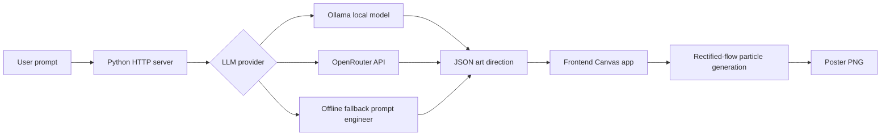

# Prompt-to-Flow Poster Studio

Student ID: 314833009

Prompt-to-Flow Poster Studio is a lightweight generative AI app that combines an LLM prompt-expansion workflow with a browser-based rectified-flow style poster generator. The user writes a creative brief, the backend expands it into a visual art direction, and the frontend animates particles from random noise into a structured poster composition.

## Features

- LLM prompt engineering pipeline for visual specification generation.
- Optional Ollama or OpenRouter integration with OpenAI-compatible style model access.
- Offline fallback so the demo still runs without API keys or internet.
- Canvas-based Flow Matching visualization: particles interpolate from noise distribution to target visual structure.
- Interactive controls for flow steps, guidance strength, and particle count.
- PNG export for demonstration material.

## System Architecture



## Technical Requirements Mapping

| Course requirement | Implementation |
| --- | --- |
| Large Language Models | `src/llm_client.py` calls Ollama or OpenRouter and uses a structured prompt to request JSON art direction. |
| Prompt Engineering | The system prompt forces compact JSON with title, palette, objects, mood, motion, and prompt fields. |
| Diffusion / Flow Matching | `src/app.js` implements a rectified-flow inspired particle path from random noise to deterministic target points. |
| App Interface | `src/index.html`, `src/styles.css`, and `src/app.js` provide a local interactive browser app. |
| Agentic Workflow | `docs/WORKFLOW_LOG.md` records the planning, design, implementation, and packaging process. |

## Local Setup

Python 3.10 or later is recommended. No mandatory third-party package is required.

### Recommended When Ollama Is Installed

Install Ollama first if the `ollama` command is not available in your terminal. Download it from the official Ollama page: https://ollama.com/download

After installation, restart your terminal so the `ollama` command is available. Then start Ollama in one terminal if it is not already running:

```powershell
ollama serve
```

Then open another terminal in the project folder:

```powershell
cd 314833009_HW7_project
ollama pull llama3.1
$env:LLM_PROVIDER="ollama"
$env:OLLAMA_MODEL="llama3.1"
python src/server.py
```

If you are already inside `314833009_HW7_project`, skip the `cd 314833009_HW7_project` line.

Open the app:

```text
http://127.0.0.1:8000
```

### Fallback Mode

If Ollama or OpenRouter is not configured, the app still runs with offline fallback. This is the most portable grading mode:

```bash
python src/server.py
```

Module mode also works in environments that can resolve the `src` package:

```bash
python -m src.server
```

## Optional LLM Modes

### Ollama

Install and run Ollama, then pull a chat model:

```bash
ollama pull llama3.1
$env:LLM_PROVIDER="ollama"
$env:OLLAMA_MODEL="llama3.1"
python src/server.py
```

### OpenRouter

Set an OpenRouter API key and choose a model:

```bash
$env:LLM_PROVIDER="openrouter"
$env:OPENROUTER_API_KEY="your_api_key"
$env:OPENROUTER_MODEL="opencode/big-pickle"
python src/server.py
```

If neither provider is available, the app automatically uses an offline fallback so the demonstration can still run.

## File Structure

```text
314833009_HW7_project/
  README.md
  requirements.txt
  src/
    app.js
    index.html
    llm_client.py
    server.py
    styles.css
  docs/
    WORKFLOW_LOG.md
  assets/
    314833009_HW7.png
```

## How to Demo

1. Start the local server. For portable fallback mode, run `python src/server.py`. For Ollama mode, set `$env:LLM_PROVIDER="ollama"` and `$env:OLLAMA_MODEL="llama3.1"` first.
2. Enter a creative brief, for example: `台北夜市裡的未來感 AI 音樂祭，霓虹招牌、雨後反光與人群能量`.
3. Click `Generate`.
4. Watch the Flow Matching particles converge into a poster.
5. Click `Download PNG` to export the generated result.

## Notes

This project is intentionally dependency-light for reproducible grading. It supports real LLM prompt expansion through Ollama or OpenRouter. If neither provider is configured, the app uses an offline fallback that keeps the same structured output format so the interface remains runnable during grading.
